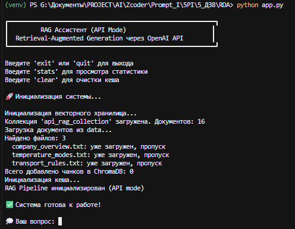
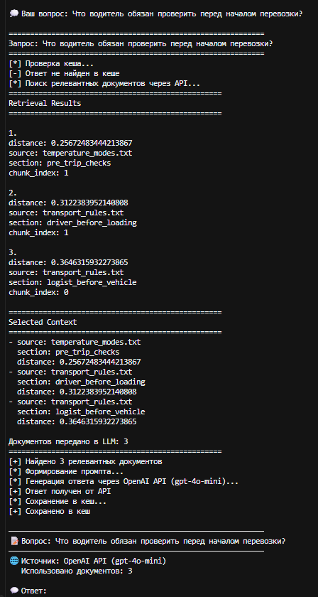

# 🚀 RAG Document Assistant

Интеллектуальный ассистент на базе **Retrieval-Augmented Generation (RAG)** для поиска информации по документам с использованием семантического поиска, векторной базы данных ChromaDB и моделей OpenAI.

Проект демонстрирует современный подход к созданию RAG-систем с защитой от галлюцинаций, кэшированием ответов и автоматической оценкой качества с помощью **RAGAS**.

---

# ✨ Возможности

- 📄 Загрузка документов в базу знаний
- 🧠 Семантический поиск с помощью OpenAI Embeddings
- 📚 Векторное хранилище ChromaDB
- ✂️ Section-aware Chunking
- 🎯 Фильтрация результатов по порогу релевантности
- ⚡ Кэширование запросов
- 📊 Диагностика Retrieval
- 🚫 Защита от галлюцинаций
- ✅ Автоматическая оценка качества ответов (RAGAS)

---


# # 📸 Скриншоты

 

## Запуск приложения

 



 

---

 

## Поиск по базе знаний

 



 

---

 

## Оценка качества RAGAS

 

RAGAS

# 🏗 Архитектура проекта

```text

Документы

     │

     ▼

Предобработка

     │

     ▼

Разбиение на чанки

     │

     ▼

OpenAI Embeddings

     │

     ▼

ChromaDB

     │

     ▼

Semantic Search

     │

     ▼

Фильтрация по Distance Threshold

     │

     ▼

LLM (GPT)

     │

     ▼

Ответ пользователю

```

---


# 🛠 Используемые технологии

- Python 3.12
- OpenAI API
- ChromaDB
- LangChain
- RAGAS
- SQLite
- dotenv

---


# 📂 Структура проекта

```text

rag-document-assistant/

│

├── [app.py](http://app.py)

├── rag_[pipeline.py](http://pipeline.py)

├── vector_[store.py](http://store.py)

├── [cache.py](http://cache.py)

├── evaluate_[ragas.py](http://ragas.py)

├── requirements.txt

├── .gitignore

│

└── data/

    ├── company_overview.txt

    ├── transport_rules.txt

    └── temperature_modes.txt

```

---


# ⚙️ Установка

```bash

git clone <repository>

cd rag-document-assistant

python -m venv venv

venv\Scripts\activate

pip install -r requirements.txt

```

Создать файл `.env`

```env

OPENAI_API_KEY=your_api_key

```

---


# ▶️ Запуск

Запуск ассистента

```bash

python [app.py](http://app.py)

```

Оценка качества RAG

```bash

python evaluate_[ragas.py](http://ragas.py)

```

---


# 📊 Результаты оценки

В ходе тестирования были получены следующие результаты:

| Метрика | Значение |

|---------|----------|

| Faithfulness | **1.0000** |

| Context Precision | **1.0000** |

| Общая оценка | **1.0000** |

Это означает, что система:

- использует только найденный контекст;
- не добавляет вымышленные факты;
- корректно извлекает релевантные документы.

---


# 💡 Особенности реализации

В отличие от базовой реализации RAG, в проект были добавлены:

- section-aware chunking;
- дополнительные метаданные документов;
- фильтрация по Distance Threshold;
- диагностика Retrieval;
- SQLite-кэширование;
- отказ от генерации ответа при отсутствии релевантного контекста;
- автоматическая оценка качества через RAGAS.

---


# 🔮 Возможные улучшения

- Web-интерфейс (Streamlit/FastAPI)
- Гибридный поиск (BM25 + Embeddings)
- Поддержка PDF и DOCX
- История диалогов
- Переранжирование результатов
- Docker-контейнеризация

---


# 👨‍💻 Автор

Проект разработан в рамках изучения технологий Retrieval-Augmented Generation (RAG) и современных методов построения интеллектуальных ассистентов.