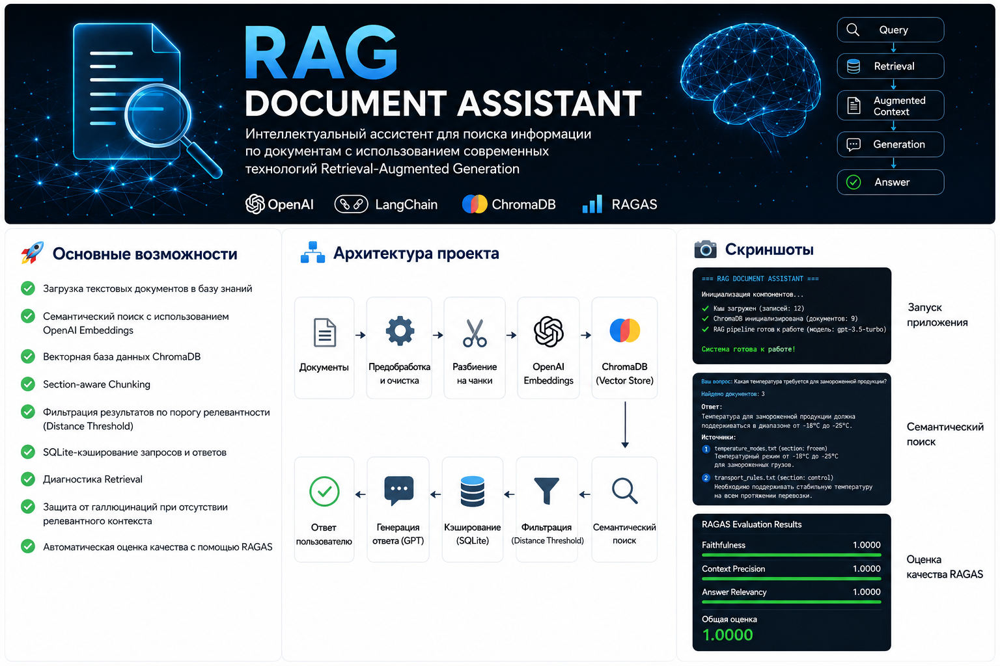
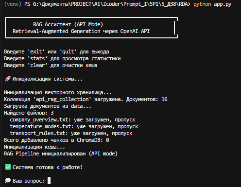
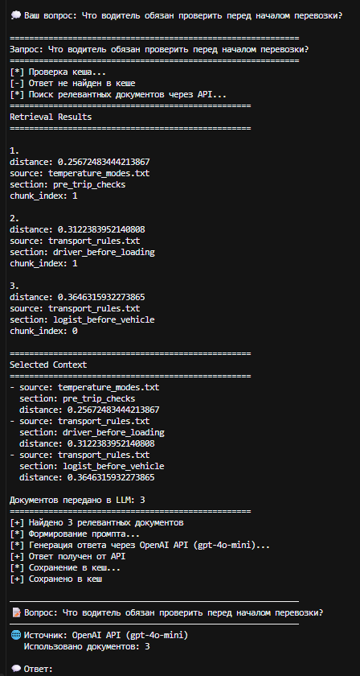
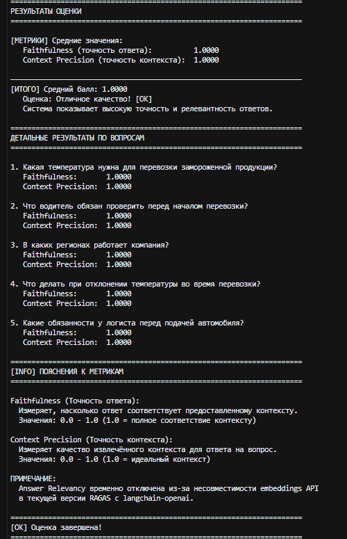

# 🚀 RAG Document Assistant

AI-ассистент для поиска информации во внутренних документах компании и формирования ответов на естественном языке.

Пользователь задаёт обычный вопрос, система находит релевантные фрагменты документов и передаёт их модели OpenAI для формирования ответа. Такой подход позволяет создавать корпоративные базы знаний, помощников для сотрудников, службы поддержки и внутренних AI-ассистентов.

В проекте реализованы семантический поиск, ChromaDB, OpenAI Embeddings, фильтрация нерелевантного контекста, кэширование и автоматическая оценка качества RAG-системы.

<p align="center">
  
</p>

---


## 🎯 Что демонстрирует проект

- 📄 Создание базы знаний из документов компании
- 🔎 Семантический поиск информации по смыслу, а не только по ключевым словам
- 🤖 Формирование ответов на основе найденного контекста
- 🛡️ Снижение риска галлюцинаций LLM за счёт контроля релевантности
- ⚡ Кэширование повторяющихся запросов
- 📊 Автоматическую оценку качества RAG-системы
- 🏢 Возможность адаптации под внутреннюю документацию конкретного бизнеса

---


# # 📸 Скриншоты

 

## Запуск приложения

 



 

---

 

## Поиск по базе знаний

 



 

---

 

## Оценка качества RAGAS

 



# 🏗 Архитектура проекта

```text

Документы

     │

     ▼

Предобработка

     │

     ▼

Разбиение на чанки

     │

     ▼

OpenAI Embeddings

     │

     ▼

ChromaDB

     │

     ▼

Semantic Search

     │

     ▼

Фильтрация по Distance Threshold

     │

     ▼

LLM (GPT)

     │

     ▼

Ответ пользователю

```

---


# 🛠 Используемые технологии

- Python 3.12
- OpenAI API
- ChromaDB
- LangChain
- RAGAS
- SQLite
- dotenv

---


# 📂 Структура проекта

```text

rag-document-assistant/
│
├── app.py
├── rag_pipeline.py
├── vector_store.py
├── cache.py
├── evaluate_ragas.py
├── requirements.txt
├── .gitignore
│
└── data/
    ├── company_overview.txt
    ├── transport_rules.txt
    └── temperature_modes.txt

```

---


# ⚙️ Установка

```bash

git clone <repository>

cd rag-document-assistant

python -m venv venv

venv\Scripts\activate

pip install -r requirements.txt

```

Создать файл `.env`

```env

OPENAI_API_KEY=your_api_key

```

---


# ▶️ Запуск

Запуск ассистента

```bash

python app.py

```

Оценка качества RAG

```bash

python evaluate_ragas.py

```

---


# 📊 Результаты оценки

В ходе тестирования были получены следующие результаты:

| Метрика | Значение |
|---|---:|
| Faithfulness | **1.0000** |
| Context Precision | **1.0000** |
| Общая оценка | **1.0000** |

На тестовом наборе система показала высокую точность использования найденного контекста и корректное извлечение релевантных документов.

---


# 💡 Особенности реализации

В отличие от базовой реализации RAG, в проект были добавлены:

- section-aware chunking;
- дополнительные метаданные документов;
- фильтрация по Distance Threshold;
- диагностика Retrieval;
- SQLite-кэширование;
- отказ от генерации ответа при отсутствии релевантного контекста;
- автоматическая оценка качества через RAGAS.

---


# 🔮 Возможные улучшения

- Web-интерфейс (Streamlit/FastAPI)
- Гибридный поиск (BM25 + Embeddings)
- Поддержка PDF и DOCX
- История диалогов
- Переранжирование результатов
- Docker-контейнеризация

---


## 👨‍💻 О проекте

Проект демонстрирует практическую реализацию RAG-системы для работы с корпоративной базой знаний.

Решение может быть адаптировано под внутренние документы и бизнес-процессы компании: инструкции, регламенты, базы знаний, документацию и другие корпоративные источники информации.
